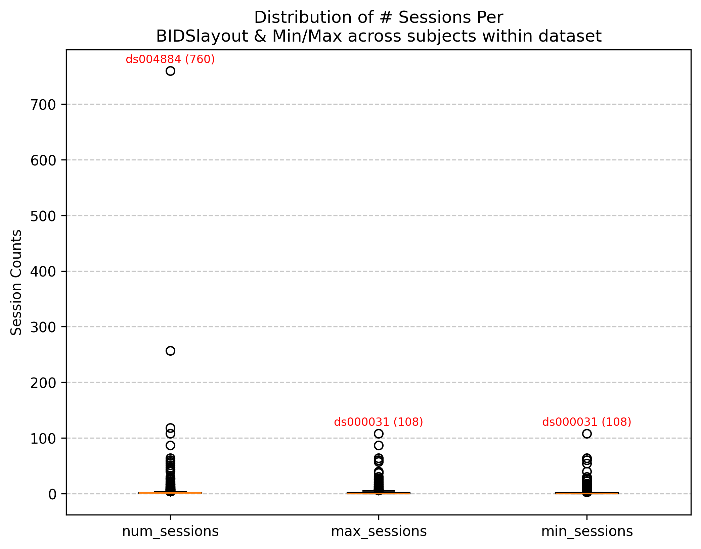
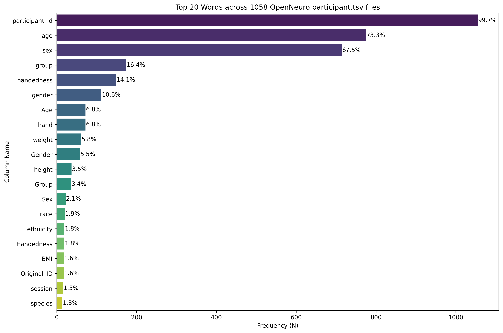
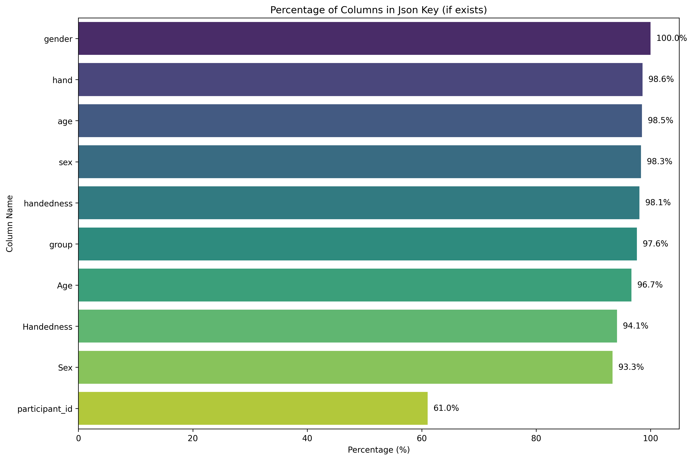

# OpenNeuro Metadata

## Overview

This repository contains metadata extraction scripts for analyzing datasets on OpenNeuro.org. As OpenNeuro continues to grow, this information is essential for understanding the structures and values.


The scripts analyze cloned BIDS (Brain Imaging Data Structure) datasets, extracting, validating and summarizing key metadata components. While they review basic metadata across ALL datasets, they prioritize checks relevant to MRI/fMRI (e.g. BOLD, events files, etc.). Contributions from MEG/EEG/fNIRS/DWI experts are welcome and **highly** encouraged.

## Structure

Modular structure consisting of six main components:

1. **Main Processing Module** (`check_files.py`) - Functions for BIDS dataset analysis and extraction
2. **Dataset List Manager** (`get_runlist.py`) - Compares available OpenNeuro datasets (from [Joe Wexler's metadata repo](https://github.com/jbwexler/openneuro_metadata)) against already processed datasets by checking for existing output files in `./output/dataset_output`. Creates `./scripts/rerun_details/datasets_torun.tsv` containing datasets that need processing
3. **Metadata Extraction Script** (`run_metacheck.py`) - Python script that clones individual datasets using datalad, extracts metadata, and saves results to separate CSV files per dataset
4. **SLURM Submission** (`check_metadata.sbatch`) - Uses `--array` to process multiple OpenNeuro datasets in parallel, reading dataset IDs from `./scripts/rerun_details/datasets_torun.tsv'. Tracks completion status and failures with timeout handling (max 25 concurrent jobs to prevent resource contention & max 1:57min run time per job)
5. **Download/Clone Data** (`download_data.py`) - Code to use datalad clone for missing/updated datasets. Note: Chris recommends `datalad install -r ///openneuro` for full cloning, but but I found this can be less efficient on Sherlock as OpenNeuro grow
6. **Figure Generation Script** (`create_figures.py`) - Combines all data from `./output/dataset_output` into `combined_*.csv` files and generates metadata visualizations

## Usage

### Command Line Interface

**Clone repo:**
```bash
git clone https://github.com/demidenm/openneuro_scrub.git
cd openneuro_scrub
```

**Setup environment:**
```bash
bash setup.sh
```

**Create list of datasets to run:**
```bash
# within scripts folder
uv run python get_runlist.py \
    --dir_path "/path/to/openneuro/datasets" \
    --repo_dir "/path/to/openneuro_scrub" 
```

**Run metadata check:**

Option 1: SLURM - Iterate over array list of OpenNeuro IDs from `datasets_torun.tsv`
```bash
# within scripts folder, after updating --array in sbatch
sbatch check_metadata.sbatch 
```

Option 2: Run on single dataset
```bash
uv run python run_metacheck.py \
    --dir_path "/path/to/openneuro/datasets" \
    --out_folder "../output" \
    --openneuro_id "ds000000"
```

**Generate visualizations:**
```bash
uv run python create_figures.py
```

## Key Features

### BIDS Folder Analysis
- **Layout Validation**: Detects BIDS vs BIDS-derivative structures
- **File Existence Checking**: Validates required and recommended BIDS files
- **Multi-level Analysis**: Extracts metadata at dataset, participant and event levels
- **Parallel Processing**: Concurrent dataset processing (controllable via CPU input)

### Types of Metadata Extraction

#### Dataset-Level Metadata
- Dataset structure validation (input vs derivative)
- Subject, task, run and session counting
- Neuroimaging file type detection (T1w, T2w, BOLD, DWI)
- Task categorization (rest vs non-rest paradigms)

#### File-Level Validation
- Required BIDS files: `CHANGES`, `README`, `participants.json/tsv`, `dataset_description.json`
- Task-specific files: `task-*_events.json/tsv`, `task-*_bold.json`
- File location tracking (top-level, functional, lower-level or missing)
- Optional files: `scans.tsv`, `sessions.tsv`

#### Participant Data Processing
- Conversion of tabular participant data to long-format key-value pairs
- Participant metadata schema validation (columns in participants.tsv described in participants.json)

#### Event Data Analysis
- Task-specific event file processing
- Event metadata schema validation (columns in events.tsv described in events.json)

## Visualizations

- **Growth trend analysis** of OpenNeuro datasets and derivatives
- **File type percentage** across OpenNeuro datasets


- **Subject/task/run distribution**


- **Session distribution**



- **Word frequency** analysis of descriptor, participant and events files







## Main Functions in `check_files.py`

### `basic_layout(root_dir, open_id)`
Creates and validates BIDS layout objects, handling both standard BIDS and derivative datasets.

### `check_basics(layout_bids, study, files_to_check)`
Checks presence and location of essential BIDS files with dynamic file list generation based on detected non-rest tasks.

### `compile_study_df(open_id, layout, subs, tasks, runs, sessions, type_dir)`
Generates comprehensive dataset-level statistics including subject counts, session ranges and BOLD/DWI modality.

### `process_participant_data(layout, open_id, part_json_exists)`
Transforms participant demographic and phenotypic data into analyzable long-format with JSON schema validation.

### `process_event_data(layout, open_id, task, events_json_exists)`
Processes task-specific behavioral event data with metadata validation and long-format conversion.

### `process_study(open_neuro_id, datadir)`
Master function that orchestrates all analysis for a single dataset with error handling and result aggregation.


## Output Files

The analysis generates five CSV files per dataset:

- `*_basics_summary.csv` - File presence validation results
- `*_counts_summary.csv` - Dataset-level statistical summaries  
- `*_descriptors.csv` - Dataset description metadata
- `*_participants.csv` - Participant demographic and phenotypic data
- `*_events.csv` - Behavioral task event data

## Generated Visualizations

The figure generation script creates:

- `file_type_percentage.png` - Percentage of datasets containing each file type
- `file_counts-subjects.png` - Distribution of subject counts across datasets
- `file_counts-runs-tasks.png` - Distribution of runs and tasks
- `file_counts-sessions-minmax.png` - Session count distributions
- `descriptor-freq_top-20words.png` - Most common descriptor file keys
- `participant-freq_top-20words.png` - Most common participant file keys
- `participantjson-freq_top-20words.png` - JSON key validation percentages
- `events-freq_top-20words.png` - Most common event file keys
- `participant-wordcloud.png` - Word cloud of participant metadata
- `openneuro_datasets-growth.png` - Growth trends for datasets and derivatives

## Requirements

- **Python Environment**: uv python manager, Python 3.8+
- **External Dependencies**: datalad for dataset management

## License 

MIT License