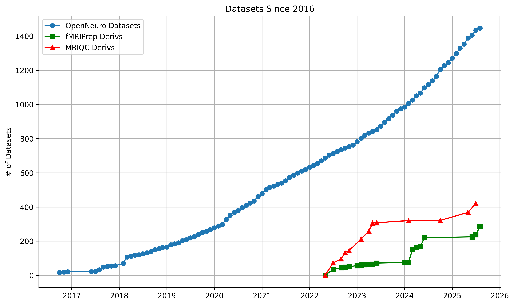
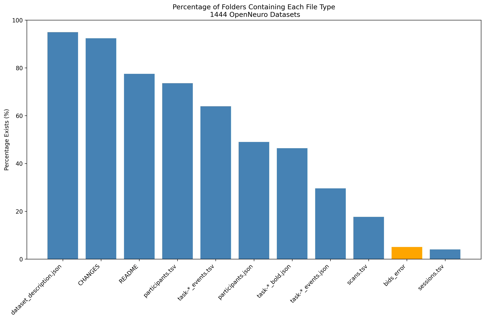

# OpenNeuro Metadata

## Overview

This repository consists of metadata extraction scripts that are used to extract information about datasets on OpenNeuro.org. This information is essential as OpenNeuro continues to group.




The scripts here analyze the [cloned] BIDS (Brain Imaging Data Structure) datasets. They extract, validate and summarize key metadata components across all of the [available] OpenNeuro datasets. While it review the basic meta data information across ALL datasets, it priortizes checks relavant to MRI / fMRI (e.g. BOLD, events files, etc). Contribute from MEG/EEG/fNIRS/DWI experts is welcome and encouraged.

## Structure

Modular design consisting of five main components:

1. **Main Processing Module** (`check_files.py`) - Contains functions for BIDS dataset analysis / extraction
2. **Full Metadata Script** (`first_complete_run.py`) - During initial run, parallel processing to extract and aggregate information for ALL OpenNeuro data cloned within a specified directory via `datalad install -r ///openneuro`
3. **Partial Execution Script** (`partial_run.py`) - After the initial run (#2), use partial run to process missing datasets without rerunning complete analysis (Checked against metadata on [repo by Joe Wexler](https://github.com/jbwexler/openneuro_metadata) and cross-referenced with IDs within specified local directory)
4. **Download/Clone Data** (`download_data.py`) - Dataset acquisition using datalad (Chris recommends: `datalad install -r ///openneuro` for first installation, then datalad clone for missing/updated datasets)
5. **Figure Generation Script** (`create_figures.py`) - Generate some figures of extracted metadata

## Usage

### Command Line Interface

**clone repo:**
```bash
git clone https://github.com/demidenm/openneuro_scrub.git
cd openneuro_scrub

```

**setup env/uv:**
```bash
bash setup.sh
```

**Full processing run:**
```bash
uv run python first_complete_run.py \
    --dir_path /path/to/openneuro/datasets \
    --out_folder /path/to/output \
    --n_cpus 6
```

**Partial processing run:**
```bash
uv run python partial_run.py \
    --dir_path /path/to/openneuro/datasets \
    --out_folder /path/to/output \
    --n_cpus 4
```

**Generate visualizations:**
```bash
uv run python create_figures.py
```

### SLURM Runs
```bash
# Full processing
sbatch check_metadata.sh full

# Partial processing  
sbatch check_metadata.sh partial

```

## Key Features

### BIDS Folder Analysis
- **Layout Validation**: Detects BIDS vs BIDS-derivative structures
- **File Existence Checking**: Checks existence of required and recommended BIDS files
- **Multi-level Analysis**: Extracts metadata at dataset, participant and event levels
- **Parallel Processing**: Uses parallel processing for concurrent dataset processing (control via CPU # input)

### Types of Metadata Extraction

#### Dataset-Level Metadata
- Dataset structure validation (input vs derivative)
- Subject, task, run and session counting
- Neuroimaging file type detection (T1w, T2w, BOLD, DWI)
- Task categorization (rest vs non-rest paradigms)

#### File-Level Validation
- Required BIDS files: `CHANGES`, `README`, `participants.json/tsv`, `dataset_description.json`
- Task-specific files: `task-*_events.json/tsv`, `task-*_bold.json`
- File Location tracking (top-level, functional, lower-level or missing)
- Optional files: `scans.tsv`, `sessions.tsv`


#### Participant Data Processing
- Conversion of tabular participant data to long-format key-value pairs
- Participant metadata schema validation (e.g., are columns in participants.tsv described in participants.json)

#### Event Data Analysis
- Task-specific event file processing
- Event metadata schema validation (e.g. are columns in events.tsv described in events.json)

### Figures
- **Growth trend analysis** of OpenNeuro datasets and derivatives
- **File type percentage** across OpenNeuro datasets, % of files that exists
]
- **Subject/task/run distribution**: visualize the distribution of number of subjects, tasks and runs


- **Session distribution**: visualize the distribution of number of sessions

- **Word frequency**: Frequency of keys in descriptor, participant and events files


## Main Functions in `check_files.py`

### `basic_layout(root_dir, open_id)`
Creates and validates BIDS layout objects, handling both standard BIDS and derivative datasets.

### `check_basics(layout_bids, study, files_to_check)`
 Checks the presence and location of essential BIDS files with dynamic file list generation based on detected non-rest tasks.

### `compile_study_df(open_id, layout, subs, tasks, runs, sessions, type_dir)`
Generates comprehensive dataset-level statistics including subject counts, session ranges and BOLD/DWI modality.

### `process_participant_data(layout, open_id, part_json_exists)`
Transforms participant demographic and phenotypic data into analyzable long-format with JSON schema validation (e.g., validates TSV columns against JSON keys).

### `process_event_data(layout, open_id, task, events_json_exists)`
Processes task-specific behavioral event data with metadata validation and long-format conversion (e.g., validates TSV columns against JSON keys).

### `process_study(open_neuro_id, datadir)`
Master function that runs all analysis mentioned above for a single dataset with error handling and result aggregation.

### `append_csv(new_df, file_path, index=False, backup=True)`
Using in partial_run, CSV appending function with automatic backup creation and validation for data updates preventing overwrites when failure occurs.

## Output Files

The full and partial generates five CSV files:

- `final_basics_summary.csv` - File presence validation results
- `final_counts_summary.csv` - Dataset-level statistical summaries  
- `final_descriptors.csv` - Dataset description metadata
- `final_participants.csv` - Participant demographic and phenotypic data
- `final_events.csv` - Behavioral task event data

## Generated Visualizations

The figure generation script creates:

- `file_type_percentage.png` - Percentage of datasets containing each file type
- `file_counts-subjects.png` - Distribution of subject counts across datasets
- `file_counts-runs-tasks.png` - Distribution of runs and tasks
- `file_counts-sessions-minmax.png` - Session count distributions
- `descriptor-freq_top-20words.png` - Most common descriptor file keys
- `participant-freq_top-20words.png` - Most common participant file keys
- `participantjson-freq_top-20words.png` - JSON key validation percentages
- `events-freq_top-20words.png` - Most common event file keys
- `participant-wordcloud.png` - Word cloud of participant metadata
- `openneuro_datasets-growth.png` - Growth trends for datasets and derivatives


## Requirements
- **Python Environment**: uv python manager, Python 3.8+
- **External**: datalad for dataset management

## License 

MIT License
